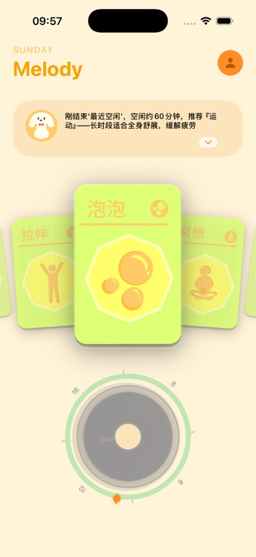
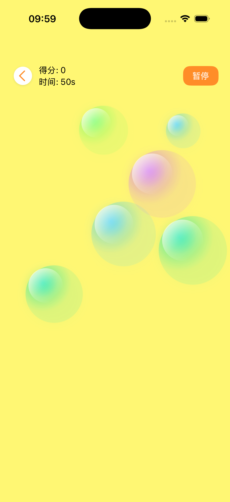
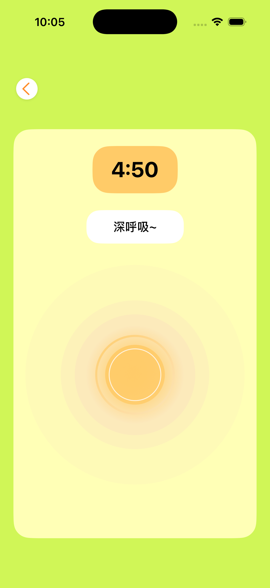
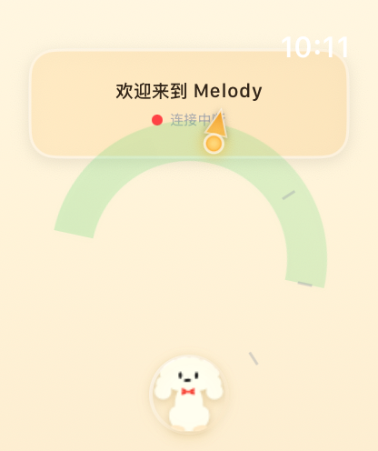

# Melody Wellness

A privacy-safe portfolio showcase for a native iOS and watchOS wellness app. Melody combines guided relaxation, touch-based mini-games, progress tracking, achievements, widgets, and Apple Watch synchronization in one SwiftUI product.

This repository is a curated showcase rather than the complete production project. It contains representative source files and product screenshots with a fresh Git history; credentials, private documents, software-registration materials, model binaries, and licensed audio/video assets are intentionally excluded.

## Product gallery

<table>
  <tr>
    <td></td>
    <td></td>
    <td></td>
    <td></td>
  </tr>
</table>

## What the full product includes

- Guided breathing, meditation, stretching, music, and free-form drawing sessions.
- Physics-driven bubble, rhythm, leaf, Taiji, whack-a-mole, and pose-controlled apple games.
- Daily, weekly, and monthly activity statistics with streak and achievement systems.
- Home-screen widgets and bidirectional Apple Watch synchronization.
- Camera and on-device pose-landmark pipelines for gesture-based interactions.

## Representative implementation

```text
Sources/
|-- iOS/
|   |-- AchievementSystem.swift
|   |-- RelaxStatsStore.swift
|   |-- BubbleSessionView.swift
|   `-- DrawingSessionView.swift
|-- Shared/
|   `-- SharedModels.swift
`-- watchOS/
    `-- WatchMainView.swift
```

The selected files demonstrate state modeling, thread-safe persistence, SwiftUI interaction design, haptic feedback, drawing geometry, achievements, and shared phone/watch models. They are provided for code review and are not a standalone build target because the private product's assets and project configuration are intentionally omitted.

## Architecture

The full application follows a SwiftUI + observable-state architecture:

- Feature views own short-lived interaction state and report completed sessions through shared stores.
- `RelaxStatsStore` serializes persistence work and exposes aggregated activity metrics.
- `AchievementSystem` derives progress and unlock state from recorded activity.
- Shared Codable models define the phone/watch data boundary.
- MediaPipe-based camera services are isolated from the SwiftUI feature layer.

## Public boundary

The private source repository remains private. This showcase excludes:

- Authentication experiments that could expose credentials through URLs or logs.
- Watch synchronization code that logged calendar event details during debugging.
- Software-registration applications, generated reports, and contributor information.
- ML model files, raw recordings, music, sound effects, and video assets.
- Xcode signing configuration, private bundle metadata, and historical commits.

The source is published for portfolio review. No redistribution or commercial-use license is granted.
